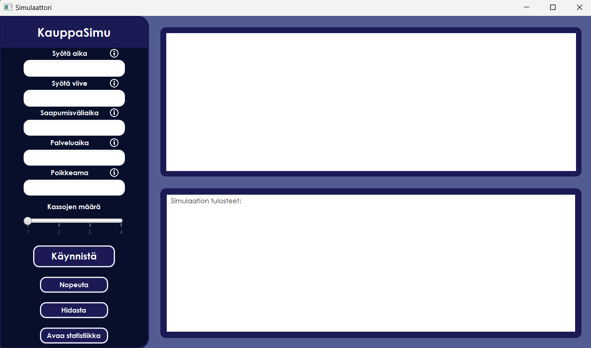
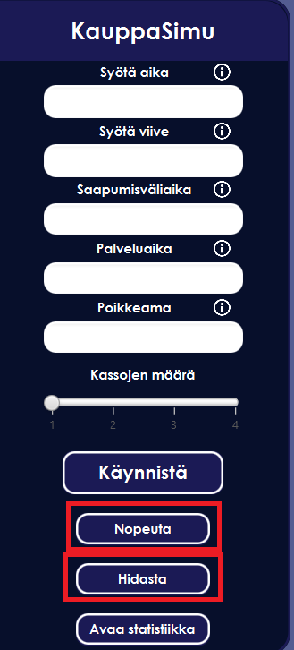

# KauppaSimu

This application is a simulation of a grocery store. The aim is to simulate the flow of customers, products, service times and the overall operation of a grocery store.

## Instructions to start the application
- Start the simulation by running the `main.java` file.
- 
  - "Syötä aika" - field is used to set the duration of the simulation.
  - "Syötä viive" - field is used to set the delay between the simulation steps.
  - "Saapumisväliaika" - field is used to set the delay between the arrival of new customers.
  - "Palveluaika" - field is used to set the duration of the service time.
  - "Poikkeama" - field is used to set the deviation of the service time.
- Select the "Kassojen määrä" - slider to set the number of cash registers. By default, the number of cash registers is set to 1.
- "Käynnistä" - button is used to start the simulation.
## During the simulation
- 
  - "Nopeuta" - button is used to speed up the simulation.
  - "Hidasta" - button is used to slow down the simulation.
